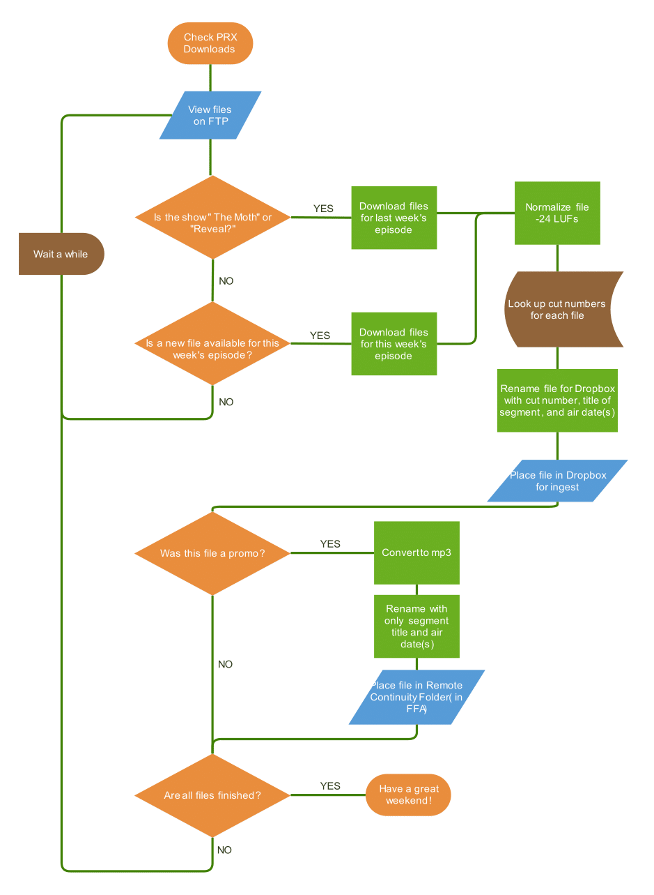

# CapRadio Weekend Programming Bot

## The Original 'Manual' Process
1. Download show files from PRX as they appear (this requires checking the ftp at regular intervals)
1. Normalize to -24 LUFs
1. Rename files for ENCO Dropbox (Ingest for ENCO DAD radio automation system)
    - EXAMPLE: `14160_Snap Judgment SEGMENT C Mar 7.wav`
1. Convert to mp3 (only needed for promos used for remote continuity)
1. Rename for remote continuity folder on network drive (i.e. promos used by remote hosts during breaks)
    - EXAMPLE: `This American Life PROMO Mar 6 and Mar 7.mp3`
1. Copy files to their appropriate destinations (ENCO Dropbox, or remote continuity folder)
1. BONUS TASK A: Get satellite files for show promos so that remote hosts can use those as well.
1. BONUS TASK B: Delete satellite files off of the backup receiver (this is so that we can keep a "hot" backup of our satellite receiver configured in the exact same way as the primary without overloading the harddrive on the receiver)



## What does this program do?
All of the above, but **automatically**.

## Features
- Automatic file downloads
    - Based on modified date as well as episode number
    - Satellite files are downloaded as well
- Renaming of files based on air date.
- Automatic renames files with the correct names based on air date
- Automatic processing of files
    - Normalization to industry standard (-24 LUFs)
    - mp3 conversion for promos
- Copying files appropriate destinations (i.e. ENCO Dropbox, or Continuity Folder)
- Deletes files from satellite receiver
- Threading (well... Python 'threading') for increased audio processing speed. (Threading allows the execution of multiple audio conversions at the same time)

## Requirements
### Development Environment
- Python 3.8.5
- Ubuntu 20.04 LTS Server (As OS or Windows Subsystem for Linux Distrubution)
---
### Dependencies
- [ffmpeg](https://ffmpeg.org/) for audio processing
- [cifs-utils](https://wiki.samba.org/index.php/LinuxCIFS_utils) (not needed on WSL) - Used for mounting Windows network drives from linux
- libraries:
    - python-dotenv
    - ffmpeg-normalize
---
## Setup
1. Clone repository (currently private)
1. Create a `.env` file in the modules folder with the following fields (NOTE: Do not use quotes around the paths)
    - Mount paths
        - `SAT_MOUNT={{ satellite samba mount path }}`
        - `DROPBOX_MOUNT={{ Dropbox samba mount path }}`
        - `FFA_MOUNT={{ remote continuity mount path }}`
        - EXAMPLE: 
            ```
            DROPBOX_MOUNT=/mnt/dropbox
            ```
    - PRX FTP credentials
        - `PRX_IP={{ IP Address }}`
        - `PRX_USERNAME={{ username }}`
        - `PRX_PASSWORD={{ password }}`
1. Create mount paths for satellite, dropbox, remote-continuity network shares. Make sure they are the same paths you set in the `.env` file.
    - EXAMPLE: 
        ```
        $ sudo mkdir /mnt/dropbox
        ```
1. Install external dependencies
    - [ffmpeg](https://ffmpeg.org/)
        ```
        $ sudo apt install ffmpeg
        ```
    - [cifs-utils](https://wiki.samba.org/index.php/LinuxCIFS_utils) - If on purely Ubuntu machine use [cifs-utils](https://wiki.samba.org/index.php/LinuxCIFS_utils) to mount Windows samba shares in Ubuntu. (NOTE: This is **NOT** needed for Windows Subsystem Linux)
        ```
        $ sudo apt install cifs-utils
        ```
1. Edit `/etc/fstab`, adding a line for each mount
    ```
    $ sudo nano /etc/fstab
    ```
    - Example for WSL:
        ```
        F:/ /mnt/foo drvfs defaults 0 0
        B:/ /mnt/bar drvfs defaults 0 0
        ```
    - Example for Ubuntu Machine
        ```
        //192.168.1.2/foo /mnt/foo cifs vers=2.0,credentials=/root/cred,iocharset=utf8 0 0

        //192.168.1.3/bar /mnt/bar cifs vers=2.0,credentials=/root/other_cred,iocharset=utf8 0 0
        ```
1. Mount Shared Drives
    ```
    $ sudo mount -a
    ```
        
1. Create Virtual Environment (in project directory)
    ```
    $ ./environ
    ```
1. Install python dependencies
    ```
    (venv) $ pip install -r requirements.txt
    ```
---
## Using This Program
This program is meant to be run using the `weekend` script. Simply run the script and it will trigger the program with any flags you enter afterward. 
```
$ ./weekend

$ ./weekend dry

$ ./weekend xds dry
```
NOTE: If you are running this on an Ubuntu Machine, you may have to run it as root to gain access to the credentials files if they are stored in the root folder (as I have done).

### Regular Execution (No Flags)
With normal execution, this program will:
1. Log into the FTP
1. Choose files to download from each show remote show directory
1. Download the chosen files
1. Normalize (processing) and rename for Dropbox
1. Convert (processing) and rename for remote continuity

### Execution Flags
Here is a list of possible flags for the program:
- Dry Run [`mock`, `dry`] - performs a dry run of the program with no downloading or processing

- Copy [`copy`] - copy files to remote continuity and dropbox folders

- Satellite [`sat`, `satellite`, `xds`] - run satellite promo processing and file deletion

- Reset [`reset`, `delete`] - deletes all audio files (used to prepare for the next week's files)

- Process Only [`process_only`, `process`] - runs processing only, no download. This was added for the times when manual download was still needed (e.g. during times when two shows were uploaded in the same week) but processing could still be done automatically.

- Clean [`clean`] - cleans .pkf files leftover from editing files in Adobe Audition

- Check Show Files [`check`, `stat`, `status`] - runs the checking program which shows which files have been downloaded and which have not.

- Threading [`thread`, `threading`] - using multi-threading to improve performance (for machines that are not using their full processing capacity)
---
## Other Considerations

### Setting Up Automatic Execution using Cron Jobs

As mentioned before, I have set this up using a machine with Ubuntu 20.04 Server installed. I have also mounted the needed shared drives for execution so that this process can be self-contained (i.e. I will not have to execute this program on another machine). The next step was to trigger the different execution paths at different times to continuously check the FTP for new show files, and continuously check the backup Satellite reciever for new files.  
  
For this implementation I have used the crontab file located at `/etc/crontab` in Ubuntu.
```
$ sudo nano /etc/crontab
```
Here is an example of the lines I have added to this file:

```
# Weekend Files
0 * * * 1-5 root cd /path/to/project && bash weekend xds
7 * * * 1-5 root cd /path/to/project && bash weekend && bash weekend copy
0 22,23 * * 0 root cd /path/to/project && bash weekend reset
```
If you haven't used cron jobs before, the first five columns with combinations of numbers and stars tell the machine when to execute command, the next column (in this case containing `root`) is the user as whom we will execute the command, and the following expressions are the command itself.  

#### **Timing Instructions**
To check your timing instructions, you can enter them in [crontab.guru](https://crontab.guru) and get an expression in English about when your commands will execute. 

The timing instructions are broken down as follows:
```
# .---------------- minute (0 - 59)
# |  .------------- hour (0 - 23)
# |  |  .---------- day of month (1 - 31)
# |  |  |  .------- month (1 - 12) OR jan,feb,mar,apr ...
# |  |  |  |  .---- day of week (0 - 6) (Sunday=0 or 7) OR sun,mon,tue,wed,thu,fri,sat
# |  |  |  |  |
```
A star denotes that the command will execute at every iteration of the time interval. 
For example: 
```
* * * * *
```

will execute every minute, of every hour, of every day of the month, of every month, on every day of the week, and 
```
7 * * * 1-5
```
will execute on minute 7 of every hour, of every day of the month, of every month, monday through friday.

#### **User**
Since we need root access for permission to read/write to the Network Drives, we will run this program as `root`

#### **Command**
Consider this command in the `crontab`:
```
cd /path/to/project && bash weekend && bash weekend copy
```
To execute this program, we will first need to navigate to the project folder `cd /path/to/project` then we use `&&` to chain another command which executes the downloading and processing `bash weekend`. After processing is done, we chain to another command which executes the program again with a `copy` flag and copies all the processed files to their destinations `&& bash weekend copy`

### Adding New Shows (PRX)
To add a new show for download/processing, three things must be changed. 
1. Processing Class
    - The processing base class has been designed so that adding a new show will only involve inheriting from `Process_BASE` and setting class variables.
    - Example:
        ```python
        class Reveal(Process_BASE):
            NUMBER_OF_SHOW_FILES = 9
            SHOW_MATCH = ['RevealWk_']
            AIR_DAYS = [4]
            SEGMENT_MATCHES = {
                'PROM01': 'promo',
                'SGMT01': 'billboard',
                'SGMT03': 'segment_a',
                'SGMT05': 'segment_b',
                'SGMT07': 'segment_c',
                'SGMT04': 'music_bed_a',
                'SGMT06': 'music_bed_b',
                'SGMT02': 'music_bed_C'
            }
            CUT_NUMBERS = {
                'promo': '17984',
                'billboard': '17978',
                'segment_a': '17979',
                'segment_b': '17981',
                'segment_c': '17983',
                'music_bed_a': '17980',
                'music_bed_b': '17982'
                # 'music_bed_c': 'NOT USED'
            }
        class Latino_USA(Process_BASE):
            SHOW_MATCH = [str(num) for num in range(35232, 35249)]
            NUMBER_OF_SHOW_FILES = 9
            AIR_DAYS = [6]
            SEGMENT_MATCHES = {
                '35232': 'promo',
                '35242': 'billboard',
                '35244': 'segment_a',
                '35246': 'segment_b',
                '35248': 'segment_c',
                '35243': 'music_bed_a',
                '35245': 'music_bed_b',
                '35247': 'music_bed_c'
            }
            CUT_NUMBERS = {
                'promo': '75292',
                'billboard': '17030',
                'segment_a': '17032',
                'segment_b': '17034',
                'segment_c': '17036',
                'music_bed_a': '17031',
                'music_bed_b': '17033',
                'music_bed_c': '17035'
            }
        ```
        - SHOW_MATCH - This is a list of strings that will be matched to determine if a file is for the specific show that this class is processing
        - NUMBER_OF_SHOW_FILES - This is used for error checking. If there are too many files, an exception will be thrown so that wrong files will be stopped from entering the system. 
        - AIR_DAYS - This is a list of integers representing the days of the week (`Monday = 0, ... , Sunday = 6`). This is used for inserting air dates (e.g. `25 Feb`) into the file names.
        - SEGMENT_MATCHES - This dictionary is used to map out which file corresponds to which show element(e.g. 'Billboard', 'Promo, 'Segment A)
        - CUT_NUMBERS - This dictionary is used to map the show element to specific cut numbers in ENCO DAD.
1. The Chooser Class (optional)
    - The `Chooser` Class is the class that selects which files to download from the FTP. For more specific timeframes, you can inherit from `Chooser` and override the offsets (usually the `first_day_offset`)
    - Example:
        ```python
        class Chooser:
            ...
            @property
            def first_day_offset(self):
                """ Returns the days to be subtracted from today to reach 
                the earliest date modified that will be accepted for download. 
                """
                # self.weekday is an integer representing the
                # current day of the week
                # 0 = Monday, ..., 5 = Saturday, 6 = Sunday
                return timedelta(days=self.weekday + 1)
        
        class Chooser_TAL(Chooser):
            """ Chooser class for This American Life
            """
            # override
            @property
            def first_day_offset(self):
                # This gets Promos uploaded Saturday.
                return timedelta(days=self.weekday + 2)
        ```

1. Edit Execution Dictionary (`./modules/coordinate.py`)
    - the `EXECUTION` dictionary in `coordinate.py` contains information for each show including which classes are needed to fully process the show files.
    - Example:
        ```python
        EXECUTIONS = {
            'RevealWk': {
                'show_name': 'Reveal',
                'chooser': choose.Chooser_Reveal,
                'processor': process.Reveal
            },
            # each entry into the EXECUTIONS dictionary is of form:
            ftp_directory_name: {
                'show_name': show_name,
                'chooser': choose.Chooser, # default Chooser
                'processor': process.Show_Process_Class
            },
            ...
        }
        ```
    - FTP Directory - add a string matching the remote directory on the PRX FTP server which corresponds to the show
    - `show_name` - yes.....the name of the show in string form
    - `chooser` - desired `Chooser` class (default is `choose.Chooser`)
    - `processor` - desired processing class

### Adding New Promos (Satellite)
For new promos processed from the satellite receiver, only two things need to be changed

1. Much like the PRX processing class, you will have to create a new show class in `./modules/satellite_process.py` that inherits from `Process_Satellite_BASE`
    - Example:
        ```python
        class Ask_Me_Another(Process_Satellite_BASE):
            SHOW_MATCH = ['AskMeA1_']
            NUMBER_OF_SHOW_FILES = 1
            AIR_DAYS = [6]
            SEGMENT_MATCHES = {'SGMT01': 'promo'}
            CUT_NUMBERS = {'promo': '17020'}
        ```
1. Add show to the `SAT_EXEC` dictionary in `./modules/coordinate.py`
    - Example:
        ```python
            SAT_EXEC = {
                'Ask_Me_Another': {
                    'show_name': 'Ask Me Another',
                    'processor': satellite_process.Ask_Me_Another
                },
                ...
            }    
        ```
