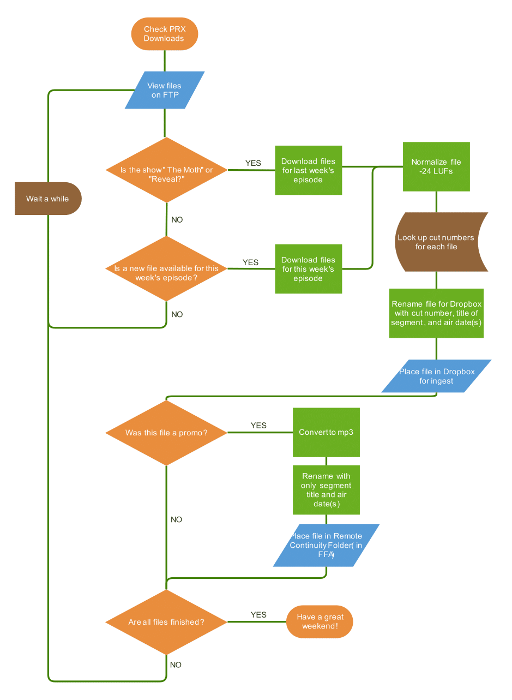

# CapRadio Weekend Programming Bot
This program automates some of the manual processes related to files for weekend programming. 

- [The Original Process](#the-original-manual-process)
- [Features](#features)
- [Requirements](#requirements)
- [Setup](#setup)
- [Using This Program](#using-this-program)
    - [Regular Execution](#regular-execution)
    - [Execution Flags](#execution-flags)
- [Setting Up Automatic Execution Using Cron Jobs](#setting-up-automatic-execution-using-cron-jobs)
- [Adding New Shows](#adding-new-shows-for-processing)


## [The Original 'Manual' Process](#capradio-weekend-programming-bot)
1. Download show files from The Public Radio Exchange (PRX) as they appear on the FTP server (this requires rechecking the FTP at regular intervals)
1. Normalize files to -24 LUFs
1. Rename files for ENCO Dropbox (Ingest program for ENCO DAD radio automation system)
    - EXAMPLE: `14160_Snap Judgment SEGMENT C Mar 7.wav`
1. Convert to mp3 (only needed for promos used by remote hosts)
1. Rename for remote host promo folder on network drive (i.e. promos used by remote hosts during breaks)
    - EXAMPLE: `This American Life PROMO Mar 6 and Mar 7.mp3`
1. Copy files to their appropriate destinations (ENCO Dropbox, or remote host promo folder)
1. BONUS TASK A: Get and convert files for show promos that hosts working remotely can use for recorded breaks.
1. BONUS TASK B: Delete satellite files off of the backup receiver (this is so that we can keep a "hot" backup of our satellite receiver configured in the exact same way as the primary without overloading the harddrive on the receiver)



## [What Does This Program Do?](#capradio-weekend-programming-bot)

All of the above, but *automatically*.

## [Features](#capradio-weekend-programming-bot)

- Downloading of files
    - FTP Login
    - Selection of files based on modified date as well as episode number
    - Satellite files are downloaded as well
- Verification of files
    - MD5 checksum ensures files are not corrupted during download.
    - Verifies segment lengths based on broadcast clock (including segments with floating breaks in between)
- Renaming of files based on air date, destination and show
- Processing of files
    - Normalization to industry standard (-24 LUFs)
    - mp3 conversion for promos
- Copying files to appropriate destinations (i.e. ENCO Dropbox, or Continuity Folder)
- Deletion of files from satellite receiver
- Threading for increased audio processing speed. (Threading allows the execution of multiple audio conversions at the same time)
- Slack notifications through [webhook workspace integration](./documentation/Slack_Setup.md#slack-workflow-setup).

## [Requirements](#capradio-weekend-programming-bot)

### Development Environment
- Python 3.8.5
- Ubuntu 20.04 LTS Server
    - As [Operating System](https://ubuntu.com/tutorials/create-a-usb-stick-on-windows#1-overview)
    - As Windows Subsystem Linux ([WSL](https://docs.microsoft.com/en-us/windows/wsl/install-win10)) Distribution from [Microsoft Store](https://www.microsoft.com/en-us/p/ubuntu-2004-lts/9n6svws3rx71?activetab=pivot:overviewtab)


### Dependencies
- [ffmpeg](https://ffmpeg.org/) for audio processing
- [cifs-utils](https://wiki.samba.org/index.php/LinuxCIFS_utils) (not needed on WSL) - Used for mounting Windows network drives from linux
- libraries:
    - python-dotenv - for environment variables
    - ffmpeg-normalize
    - requests - for slack notifications
    - mutagen - for determining length of audio files

## [Setup](#capradio-weekend-programming-bot)

1. Clone repository
    ```
    $ git clone https://github.com/jamestejada/weekend.git
    ```

1. [Setup a Slack Webhook](./documentation/Slack_Setup.md#slack-workflow-setup) (if you'd like slack notifications about which files have not been delivered yet). The instructions for setup can be found [here](./documentation/Slack_Setup.md#slack-workflow-setup).

1. Create a `.env` file in the modules folder with the following environment variable assignments (NOTE: Do not use quotes around the paths)
    - Mount paths
        - `SAT_MOUNT=/path/to/satellite/share`
        - `DROPBOX_MOUNT=/path/to/enco/dropbox`
        - `FFA_MOUNT=/path/to/remote/host/promos`
        - EXAMPLE: 
            ```
            DROPBOX_MOUNT=/mnt/dropbox
            ```
    - PRX FTP credentials
        - `PRX_IP={FTP_SERVER_ADDRESS}`
        - `PRX_USERNAME={USERNAME}`
        - `PRX_PASSWORD={PASSWORD}`
    
    - The Desired Logging Level
        - `LOG_LEVEL=info`
        - `LOG_LEVEL=debug`
    
    - The slack workflow webhook for slack integration. 
        - `SLACK_WEBHOOK=https://hooks.slack.com/workflows/{SECRET_STRING}`

1. Create mount paths for satellite, dropbox, remote host network shares. Make sure they are the same paths you set in the `.env` file.
    - EXAMPLE: 
        ```
        $ sudo mkdir /mnt/dropbox
        ```
1. Install external dependencies
    - [ffmpeg](https://ffmpeg.org/)
        ```
        $ sudo apt install ffmpeg
        ```
    - [cifs-utils](https://wiki.samba.org/index.php/LinuxCIFS_utils) - If on purely Ubuntu machine use [cifs-utils](https://wiki.samba.org/index.php/LinuxCIFS_utils) to mount Windows samba shares in Ubuntu. (NOTE: This is **NOT** needed for Windows Subsystem Linux)
        ```
        $ sudo apt install cifs-utils
        ```
1. Edit `/etc/fstab`, adding a line for each mount
    ```
    $ sudo nano /etc/fstab
    ```
    - Example for WSL:
        ```
        # /etc/fstab

        F:/continuity/promos /mnt/promos drvfs defaults 0 0
        B:/ /mnt/dropbox drvfs defaults 0 0
        S:/ /mnt/satellite drvfs defaults 0 0
        ```
    - Example for Ubuntu Machine
        ```
        # /etc/fstab

        //192.168.1.2/continuity/promos /mnt/promos cifs vers=2.0,credentials=/root/cred,iocharset=utf8 0 0
        //192.168.1.2/dropbox /mnt/dropbox cifs vers=2.0,credentials=/root/cred,iocharset=utf8 0 0
        //192.168.1.3/satellite /mnt/satellite cifs vers=2.0,credentials=/root/other_cred,iocharset=utf8 0 0
        ```
        ```
        # network share credentials file

        username={username}
        password={password}
        domain={domain}  # if needed
        ```

1. Mount Shared Drives
    ```
    $ sudo mount -a
    ```

1. Create Virtual Environment (in project directory)
    ```
    $ . environ
    ```
1. Install python dependencies
    ```
    (venv) $ pip install -r requirements.txt
    ```

## [Using This Program](#capradio-weekend-programming-bot)

This program is meant to be run using the `weekend` script. Simply run the script and it will trigger the program with any flags you enter afterward. 
```
$ ./weekend

$ ./weekend dry

$ ./weekend xds dry
```
NOTE: If you are running this on an Ubuntu Machine, you may have to run it as root to gain access to the credentials files if they are stored in the root folder (as I have done).

### Regular Execution (No Flags)
With normal execution, this program will:
1. Log into the FTP
1. Choose files to download from each show remote show directory
1. Download the chosen files
1. Normalize (processing) and rename for Dropbox
1. Convert (processing) and rename for remote host promos

### Execution Flags
Here is a list of possible flags for the program:
- Dry Run [`mock`, `dry`] - performs a dry run of the program with no downloading or processing

- Copy [`copy`] - copy files to remote host promo and dropbox folders

- Satellite [`sat`, `satellite`, `xds`] - run satellite promo processing and file deletion

- Reset [`reset`, `delete`] - deletes all audio files (used to prepare for the next week's files)

- Process Only [`process_only`, `process`] - runs processing only, no download. This was added for the times when manual download was still needed (e.g. during times when two shows were uploaded in the same week) but processing, and copying could be done by this program.

- Clean [`clean`] - cleans extraneous files leftover from editing audio in Adobe Audition

- Check Show Files [`check`, `stat`, `status`] - runs the checking program which shows which files have been downloaded and which have not.

- Threading [`thread`, `threading`] - using multi-threading to improve performance (for machines that are not using their full processing capacity)

- Verify [`verify`] - verify hashes of downloaded files and audio lengths of processed files and outputs the names of these files to the shell.


## [Setting Up Automatic Execution Using Cron Jobs](#capradio-weekend-programming-bot)

As mentioned before, I have set this up using a machine with Ubuntu 20.04 Server installed. I have also mounted the needed shared drives for execution so that this process can be self-contained (i.e. I will not have to execute this program on another machine). The next step was to trigger the different execution paths at different times to continuously check the FTP for new show files, and continuously check the backup Satellite reciever for new files.  
  
For this implementation I have used the crontab file located at `/etc/crontab` in Ubuntu.
```
$ sudo nano /etc/crontab
```

If you haven't used cron jobs before, the first five columns with combinations of numbers and stars tell the machine when to execute the command, the next column (in this case containing `root`) is the user as whom we will execute the command, and the following expressions are the command itself.  

Here is an example of the lines I have added to this file:

```
# Weekend Files
0 * * * 1-5 root cd /path/to/project && bash weekend xds
7 * * * 1-5 root cd /path/to/project && bash weekend && bash weekend copy
0 22,23 * * 0 root cd /path/to/project && bash weekend reset
```

1. The first line will delete all files on the satelllite reciever after grabbing promos and processing them for remote hosts at the top of every hour, Monday through Friday. 
2. The second line will access the PRX FTP, download programs, process them, and copy them to the appropriate destinations at 7 past the top of the each hour, Monday through Friday
3. The third line will reset the downloaded files on Sunday night (runs at 10 PM and 11 PM) in preparation for processing the next week's programs.

### **Timing Instructions**
To check your timing instructions, you can enter them in [crontab.guru](https://crontab.guru) and get an expression in English about when your commands will execute. 

The timing instructions are broken down as follows:
```
# .---------------- minute (0 - 59)
# |  .------------- hour (0 - 23)
# |  |  .---------- day of month (1 - 31)
# |  |  |  .------- month (1 - 12) OR jan,feb,mar,apr ...
# |  |  |  |  .---- day of week (0 - 6) (Sunday=0 or 7) OR sun,mon,tue,wed,thu,fri,sat
# |  |  |  |  |
```
A star denotes that the command will execute at every iteration of the time interval.  
For example: 
- `* * * * *` will execute every minute, of every hour, of every day of the month, of every month, on every day of the week 
- `7 * * * 1-5` will execute on minute 7 of every hour, of every day of the month, of every month, monday through friday

### **User**
Since I have saved network credentials in the `/root` directory, we need root access for permission to read/write to the Network Drives. We will run these commands as `root`.

### **Command**
Consider this command in the `crontab`:
```
cd /path/to/project && bash weekend && bash weekend copy
```
To execute this program, we will first need to navigate to the project folder `cd /path/to/project` then we use `&&` to chain another command which executes the downloading and processing `bash weekend`. After processing is done, we chain to another command which executes the program again with a `copy` flag and copies all the processed files to their destinations `&& bash weekend copy`

## [Adding New Shows For Processing](#capradio-weekend-programming-bot)

### Adding New PRX Shows
To add a new show for download/processing, create an instance of the `Show` class in `./modules/data.py` and add it to the `PRX_DATA_LIST` list.

### `Show` class instance example for PRX shows:
```python
THIS_AMERICAN_LIFE = Show(
    show_name='This American Life',
    remote_dir='ThisAmer',
    number_of_files=5,
    first_day_offset_offset=2,
    show_match=['ThisAmer_'],
    air_days=[5,6],
    segment_match={
        'PROM01': 'promo',
        'PROM02': 'promo_today',
        'SGMT01': 'segment_a',
        'SGMT03': 'segment_b',
        'SGMT02': 'music_bed_a'
    },
    cut_numbers={
        'promo': '25321',
        'segment_a': '17040',
        'segment_b': '17042',
        'music_bed_a': '17041'
    },
    timings={
        '25321': 30,
        '17041': 60
    },
    add_time_target=3480,
    add=[
        '17040',
        '17042'
    ]
)
```
- `show_name` - the show name in printable string form
- `remote_dir` - the directory name for the show on the PRX server
- `number_of_files` - the full number of files(including promos) that are part of one episode of the show. An assertion error is thrown if there are too many files to prevent processing the wrong files.
- `first_day_offset_offset` - the number of days prior to Monday in which files for the show will be chosen for download. 
    - Example: This American Life promos upload on Saturday. Since we want the bot to choose them for download, we allow for files two days before Monday (which is Saturday)
- `show_match` - a list of strings that are always in the filename of the shows from the PRX server. 
    - Example: This American Life files always contain `'ThisAmer_'` in the filenames
        - `ThisAmer_382_SGMT01.wav`
        - `ThisAmer_383_PROM02.wav`
        - `ThisAmer_381_SGMT02.wav`
- `air_days` - a list of integers describing when the show airs.
    - 4 is for Friday
    - 5 is for Saturday
    - 6 is for Sunday.        
- `segment_match` - this is a dictionary that maps a string matching the segment (e.g. `PROM01`) to the type of segment (e.g. `promo`, or `segment_a`)
- `cut_numbers` - this is a dictionary that maps the type of segment to the ENCO cut numbers (in string form)
- `timings` - this dictionary maps the matching cut numbers of an ENCO cut number to the appropriate timing in seconds (if it is a cut whose timing is not checked by adding it to other cuts)
- `add_target_time` - target time in seconds for segments whose total time is checked for accuracy
- `add` - a list of the segments whose length in seconds should be added together and compared with `add_time_target`.

### Adding New Satellite Promos
For new promos processed from the satellite receiver, create a new instance of the `Show` class and add it to the `SATELLITE_DATA_LIST` in `./modules/data.py`. Less fields are required than PRX shows.

### `Show` class instance example for satellite promos:
```python
THROUGHLINE = Show(
    show_name='Throughline',
    show_match=['Through1_'],
    number_of_files=2,
    air_days=[6],
    segment_match={'SGMT01': 'promo'},
    cut_numbers={'promo': '25318'}
)
```
- `show_name` - the show name in printable string form
- `show_match` - a list of strings that are always in the filename of the shows from the PRX server. 
    - Example: Throughline promo files always contain `'Through1_'` in the filenames
- `air_days` - a list of integers describing when the show airs.
    - 4 is for Friday
    - 5 is for Saturday
    - 6 is for Sunday.   
- `segment_match` - a dictionary mapping a segment matching string to the type of segment
- `cut_numbers` - a dictionary mapping the segment type to an ENCO cut number (in string form)


