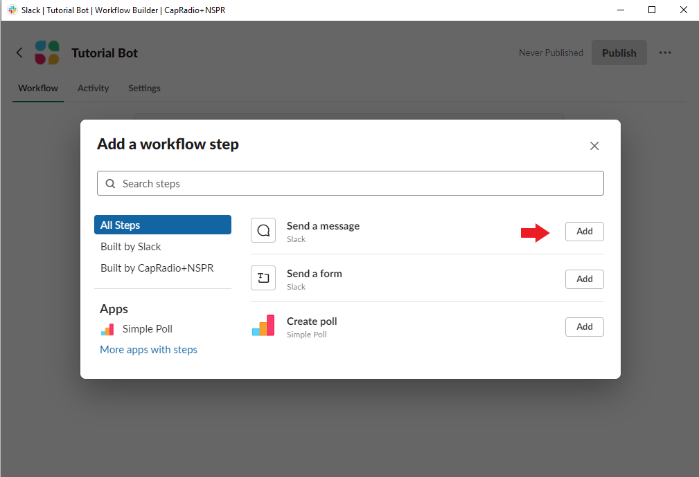

[Back to Main README](../README.md#capradio-weekend-programming-bot)

# Slack Workflow Setup

1. Open your Slack workspace and click on the Lightning Icon (found at the bottom left of the your message box). Then click on `Open Workflow Builder`. 

1. Click `Create` to create a new workflow and name your workflow. I've chosen the name `Tutorial Bot` as an example.

1. After naming your workflow, choose `Webhook` from the next menu. 

1. Select `Add Variable`.

1. Add variable names using this window. They will both be of `Data type: Text`. We will be adding two variables:
    - `show_name`
    - `missing_file_list`

1. After you have entered both, click `Next` and you will be brought back to the Workflow Builder screen. Click on `Add Step`.

1. Add `Send a message`.

1. Choose the channel which this workflow will notify, and create a notification message using the variables we have created.

1. Publish your new workflow! Be sure to copy the address for the webhook and paste it into your `.env` file. Do not share this webhook or people may be able to send strange or hilarious messages into your slack channel. 

[Back to Main README](../README.md#capradio-weekend-programming-bot)
